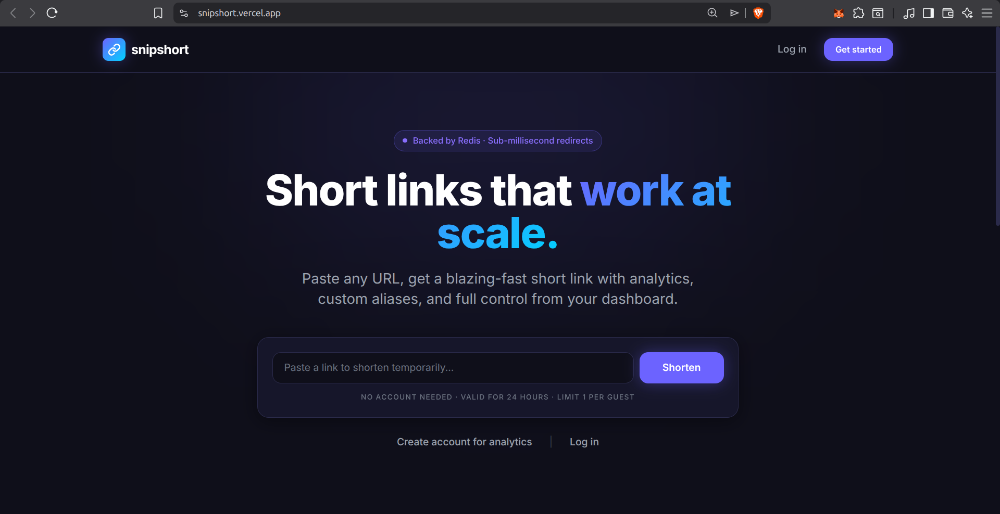
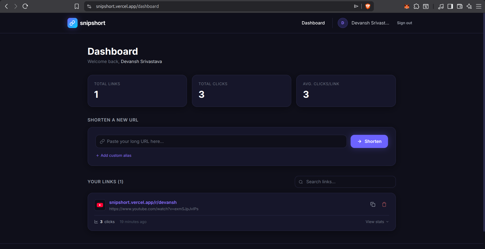
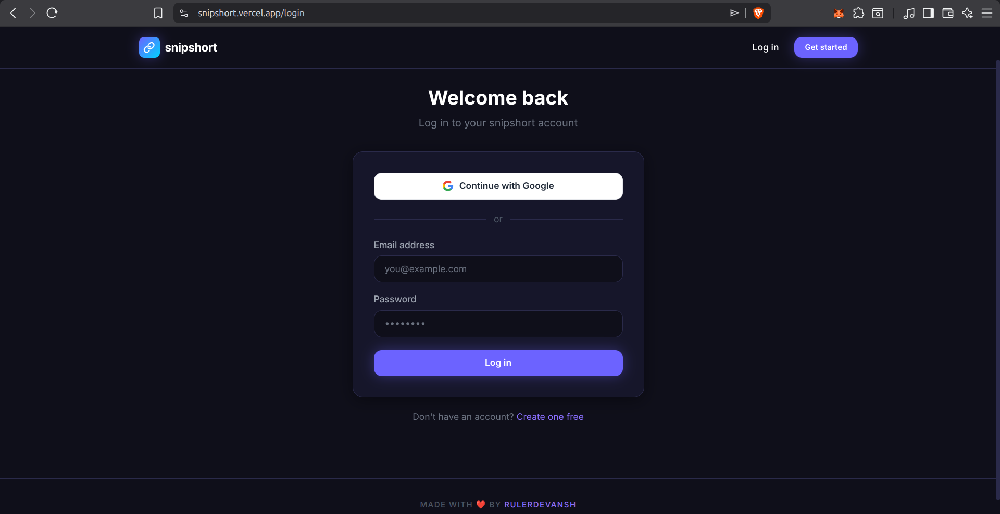

# 🚀 SnipShort — Redis-Powered URL Shortener


**SnipShort** is a high-performance, production-ready URL shortener designed for speed and scale. Built with a hybrid architecture (Vercel + AWS), it leverages Redis caching for sub-millisecond redirects and robust rate limiting.

### 🔗 [Live Demo](https://snipshort.vercel.app)

---

## 📸 Screenshots

<div align="center">
  <table flex>
    <tr>
      <td align="center" width="50%">
        <b>Home Page</b><br />
        
      </td>
      <td align="center" width="50%">
        <b>Dashboard</b><br />
        
      </td>
    </tr>
    <tr>
      <td align="center" width="50%">
        <b>Login Page</b><br />
        
      </td>
      <td align="center" width="50%">
        <b>Branding</b><br />
        
      </td>
    </tr>
  </table>
</div>

---

## ✨ Features

- ⚡ **Sub-millisecond Redirects:** Powered by Redis caching.
- 🔐 **Secure Auth:** Google OAuth 2.0 & JWT-based authentication.
- 👤 **Guest Mode:** Allow unauthenticated users to create temporary (24h) links.
- 📊 **Analytics:** Track click counts and recent activity for every link.
- 🏷️ **Custom Aliases:** Create branded, memorable short links.
- 🛡️ **Rate Limiting:** IP-based protection using Redis.
- 🐳 **Dockerized:** Fully containerised backend for seamless deployment.

---

## 🛠️ Tech Stack

- **Frontend:** React 18, Vite, Vanilla CSS (Modern Design), Axios.
- **Backend:** Node.js, Express, Sequelize ORM.
- **Data:** MySQL (Permanent storage), Redis (Cache & Rate limiting).
- **Deployment:** Vercel (Frontend), AWS EC2 (Dockerized Backend).

---

## 🚀 Quick Start (Local)

### 1. Clone the repository
```bash
git clone https://github.com/RulerDevansh/Snip_UrlShortner.git
cd Snip_UrlShortner
```

### 2. Backend Setup
```bash
cd backend
npm install
# Configure your .env file
npm run dev
```

### 3. Frontend Setup
```bash
cd ../frontend
npm install
npm run dev
```

---

## 📝 License
Built with ❤️ by [RulerDevansh](https://github.com/RulerDevansh)
